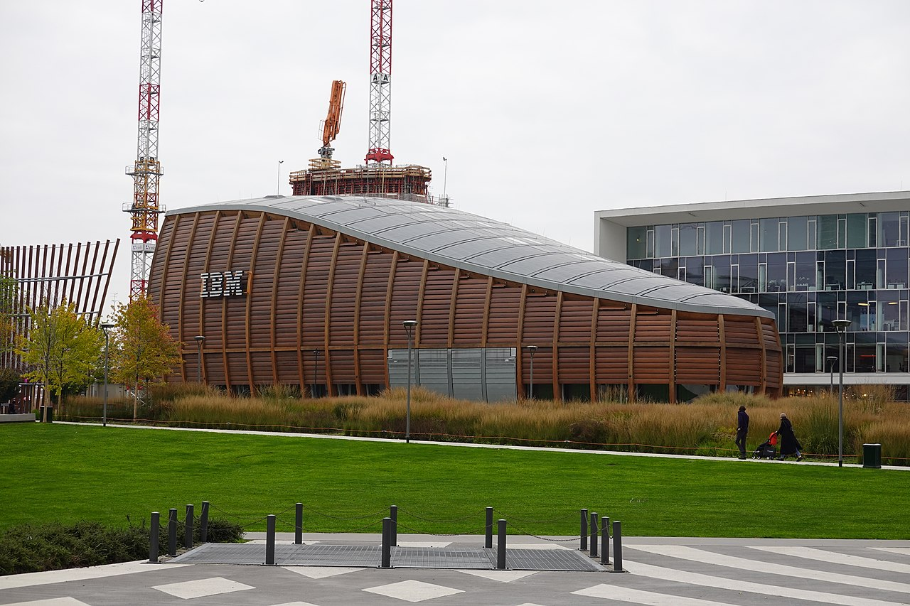
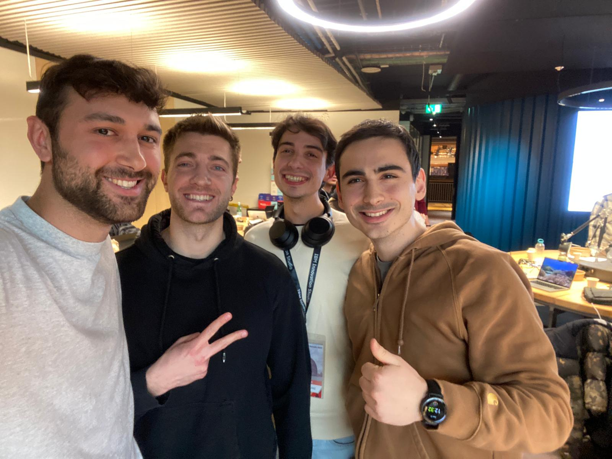
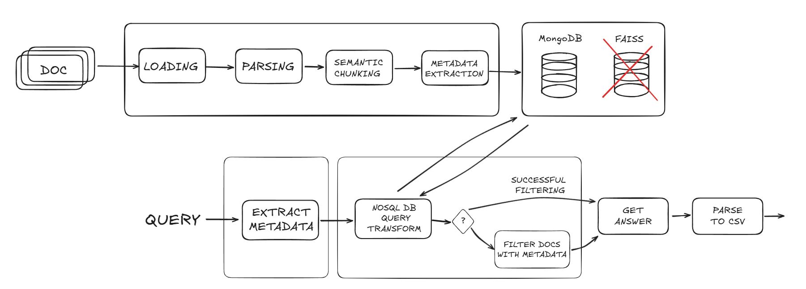
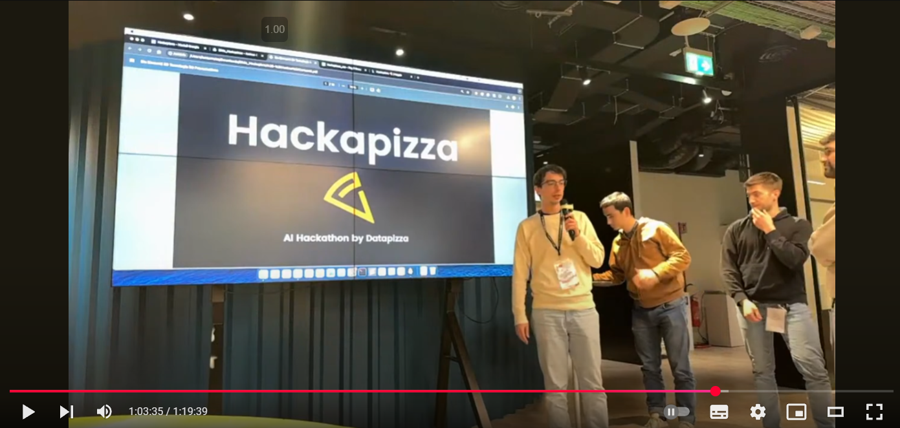
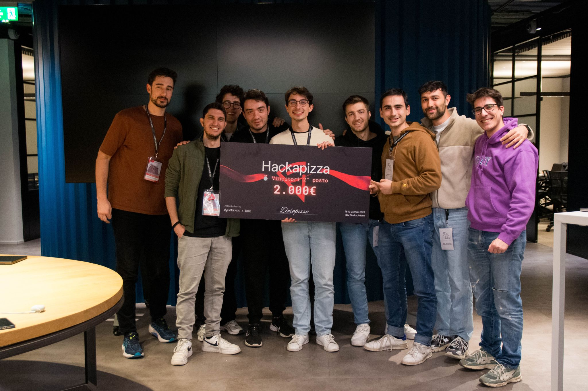

In the 18th and 19th of January 2025, I participated in my first Hackathon, [HackaPizza](https://hackathon.datapizza.com/), organized by the amazing team of [DataPizza](https://www.datapizza.tech/). It was a 24-hours event, held in Milan, Italy, in a very iconic and fascinating location: the IBM Studios, in Piazza Gae Aulenti. 




I was part of the team `4-omini` (very bad Italian joke), composed by me, [Alessandro](https://www.linkedin.com/in/alecontu/), [Andrea](https://www.linkedin.com/in/andreacerasani/) and [Cristian](https://www.linkedin.com/in/cristian-c-spagnuolo/). There were 20 teams participating, each composed of 3 or 4 members, that had been chosen by the organizers among more than 600 applicants. We knew that the bar was high, but we were ready to give our best.





Going into the event, we only knew that the Hackathon would be about Generative AI, with topics like RAG and Agents being more likely, but of course we didn't know the exact challenge. Nonetheless, we didn't really care, we just wanted to learn things, build something and enjoy the experience. Which we did!

In this write up, I will go through the highlights of the event as seen from our perspective. I will talk about the things that worked and those that didn't, as well as the reasons behind our choices and the way we got to the final solution. If you are brave enough, you can follow the story by looking at the commit history of our [GitHub repository](https://github.com/GiovanniGiacometti/hackathon). Please don't judge the quality of our code, sleep deprivation can make you do weird things.

## 12:30 - So it begins

First things first: the challenge. After a brief introduction by the organizers, the cage was opened and we were given the text of the challenge. Here is a short summary, written by Claude Sonnet 3.5:

```
"AI Challenge: Building an Intergalactic Restaurant Recommender"

Set in a sci-fi universe where interstellar dining is the norm, 
this challenge tasks developers with creating an AI assistant for 
cosmic food recommendations. The system needs to process natural 
language queries and suggest dishes from across the galaxy 
while respecting alien dietary restrictions 
and galactic food regulations.

Key technical requirements:
- Natural language query processing
- Multi-source data integration (menus, regulations, reviews)
- Generative AI implementation (RAG and AI Agents)
- Compliance verification with food safety standards

Performance evaluation uses Jaccard Similarity 
against reference solutions, measuring both accuracy 
and innovation in approach.

Think of it as Yelp meets Star Wars, powered by AI.
```

The summary is accurate, as the challenge was pretty straightforward. You might be thinking: "Well, that's a RAG". And you would be right. However, there were some complications that would make a naive RAG implementation miserably fail:

- Documents were in Italian and all the members of this imaginary universe had very weird names, barely making any sense even in Italian ("Sinfonia Cosmica all'Alba di Fenice", "Eclissi del Drago nell'Abbraccio del Kraken", ...). Standard LLMs would struggle to understand these entities if not properly instructed.
- The documents were not in a huge amount (around 60) but they were of mixed types: Pdfs, Html, Word, even a CSV. This surely complicated the data preprocessing phase.
- The content of the documents was complex: they contained a lot of noise, they were not consistent with each other and most of them was not well structured. Some pages were blurred and others filled with unknown characters. Concepts were spread across several documents, making it difficult to gather the necessary information needed for a complete understanding. Additionally, the authors of the challenge deliberately introduced typos and misleading information, further complicating the task of extracting accurate information. Yes, they were a mess.

Another relevant aspect of the challenge was the types of queries that our system was supposed to face. The questions provided were very specific and expected precise answers. This differs from typical RAG applications, where questions are more open-ended and the model can generate a wide range of (somewhat correct) answers. This meant that our retrieval system needed to demonstrate both high precision and high recall, as nearly all documents related to the query—even if they didn't directly provide the answer—were essential for accurate responses. 

For instance, a query like "Quali piatti, preparati in un ristorante su Asgard, richiedono la licenza LTK non base e utilizzano Carne di Xenodonte?"("Which dishes, prepared in a restaurant on Asgard, require the non-base LTK license and use Xenodonte meat?") would need to retrieve the menu of all restaurants on Asgard, filter the dishes that include Xenodonte meat and then compare the results with the requirements of the non-base LTK license, which would be stored in a different document, likely without direct mentions of dish or planet names.

## 13:00 - The first steps

The first hour of the challenge was basically only brainstorming. We knew that a precise and well-though plan was necessary. 

We first designed our pipeline, which would be composed of 2 main steps:
- **Ingestion**: this step is run only once and consists in parsing all documents into chunks of text and storing them in a vector database. We decided to apply semantic splitting, based on the structures of the documents, so that each chunk would contain a coherent piece of information. We chose [ChromaDB](https://www.trychroma.com/) as our vector database.
- **RAG**: the core of the system. This step receives the query as input, retrieves the relevant chunks from the database and then generates the answer using an LLM. Since the final response was supposed to be the list of ids of the dishes answering the questions, we would have to implement an additional component in order to translate the response of the LLM into the correct format. We chose [LangGraph](https://www.langchain.com/langgraph) as the framework for our RAG pipeline.   


As previously explained, we thought that a retrieval system based only on similarity between embeddings would not be enough. We decided to opt for an hybrid approach based on metadata. The process we envisioned was the following:

1) During the ingestion phase, we would ask an LLM to extract the metadata from each chunk of text. To make sure every chunk was correctly encapsulated in the context of the overall document, we would also add to each chunk the metadata extracted from the document as a whole. For instance, in the chunk related to a specific dish of a restaurant, we would add the metadata of the restaurant itself. All these metadata would then be stored in the vector database alongside the text.

2) During the RAG phase, we would first ask an LLM to extract the relevant metadata from the query. Then, we would retrieve the chunks tagged with those metadata from the database and then apply the cosine similarity to retain only the most similar chunks (this is supported out of the box by the [LangChain integration](https://python.langchain.com/docs/integrations/vectorstores/chroma/#query-by-turning-into-retriever)). Finally, we would pass the resulting chunks to the LLM to generate the answer.

At that point, we were ready to start coding. The plan was to build a functioning pipeline as soon as possible, so that we could reiterate on it and optimize it later. 

Well, that's easier said than done.


## 21:00 - At least it runs

After *many* hours of coding, almost all of the components were ready. In the meantime, other teams had already submitted their solutions. One team scored an encouraging 58%, well above the baseline provided by the organizers (38%). We were not worried, but indeed that was the realization that the competition was fierce.

We assembled the pipeline and ran it for the first time. The results were ... missing. The model was not answering at all, the `dishes` field of its [structured output](https://python.langchain.com/docs/concepts/structured_outputs/) was always empty. We were puzzled, but the behaviour was so weird that we knew there would be a reason for that. We leveraged [Langsmith](https://www.langchain.com/langsmith) to analyze each step of the pipeline and soon realized that the retrieval system was not working properly. The context provided to the LLM was always missing the relevant information. Why?

There were several problems within our metadata extraction process:

- We were not extracting enough metadata. Mainly, we were not extracting information related to the ingredients of the dishes, which were involved in most of the questions we had to answer.

- Metadata were not always consistent: the LLM extracting metadata from the query would sometimes provide metadata that were not present in the database, both due to typos and hallucinations. Since we were filtering metadata on exact matches, this would lead to no results being returned.

- Metadata were sometimes missing: the LLM would just miss some of them, leading to the same problem as above.

The first point was easy to fix: add another step in the Ingestion phase to extract the additional metadata. The second point and third points were trickier: how do you make sure that the LLM doesn't come up with a new metadata? How do you ensure that it doesn't miss any information?

We adopted the following approach: whenever we asked the LLM to extract metadata, both in the ingestion and in the RAG phase, we provided it with all previously extracted metadata. We explicitly instructed the LLM to reuse metadata if it spotted similar entries (even if slightly different, to account for typos).

We leveraged prompt engineering also to foster the LLM to avoid missing metadata, by telling it to look for "weird" names with capital letters. You can take a look at the final version of the prompt [here](https://github.com/GiovanniGiacometti/hackathon/blob/main/hackathon/graph/prompts.py#L218).

Tiredness was starting to show up, but it was time to put these ideas into practice.

## 05:00 - The first submission

Several coffees and Redbulls later, all the changes had been implemented and we were ready to run the pipeline and finally get our first submission. 

Some things had changed in the meantime:
- We switched from ChromaDB to [Faiss](https://github.com/facebookresearch/faiss) for the vector database, since the former is not able to store metadata as lists, which was necessary for our approach (the ingredients were a list of strings).
- We translated all our prompts into Italian, hoping that the LLM would better understand the entities of the documents.
- The leaderboard was updated: the team that had scored 58% was now at 67% and another team submitted a solution that scored 63%. The bar was getting higher.

Nonetheless, we were eager to see the results we would achieve. We executed the pipeline, obtained the CSV file, submitted it and ... 9%. As an italian proverb say: "Yes, it can get worse, it could have rained". We were a bit disappointed, but we couldn't afford wasting time. We were back in debugging mode. 

We noticed that the metadata extraction and the successive filtering were working properly, but most of the times the chunks provided to the LLM were not helpful at all. This happened in cases where the metadata filtering was too large, and the retrieved context would only be due to the cosine similarity, which was definitely not enough to distinguish relevant information from useless one. Unfortunately, these cases were the majority, since a lot of metadata were shared among the chunks and we were only able to filter metadata on exact matches.

The problem was not in our code (you can see the filtering process [here](https://github.com/GiovanniGiacometti/hackathon/blob/main/hackathon/graph/nodes/retrieve.py)), but rather in the way we were treating the vector store. These systems are designed for embeddings and similarity operations, not for complex database-like querying. Metadata are usually simple and intended for straightforward filtering. While it is possible to build more advanced querying capabilities on top of them (which we did, to some extent), making it truly effective would require a more comprehensive implementation, which we didn't have time for.

In addition to this, the issues with the embeddings similarity previously mentioned were starting to show up, further diminishing the relevance of the retrieved chunks..

We were at a crossroad: on one hand, we could try to improve the retrieval system and the resilience of the pipeline. On the other hand, we could instead rethink our approach and try to use a proper database to store metadata and perform more complex queries on them. 

We were 4 people: we could do both and choose the best solution later. And that's what we did.


## 08:30 -  Summer is coming

The night was over. The sun was rising. But we didn't see any of that. 

Like two threads that forked from the main process, we were ready to rejoin.

While the refactoring of the retrieval system was ongoing, we managed to improve our pipeline with some optimizations:

- we refined all prompts, making them more specific and resorting to few-shots prompting in some of them.
- we switched from filtering metadata on exact matches to a fuzzier approach, based on checking the number of overlapping letters between the metadata extracted from the query and the metadata stored in the database. This allowed more flexibility and increased the resilience to typos and hallucinations.
- we added a new component of the graph, which would take in input all the chunks retrieved from the vector database and, for each of them, ask an LLM if it was relevant to the query. If not, it would be discarded. The idea behind this approach is to reduce the noise passed to the final LLM, who would then hopefully receive only useful chunks.

We submitted multiple times during this process and results were improving. First 15%, then 25%, then 30%. We were getting better, but the highest part of the standings was still far away.

Later, we realized that we were not retrieving enough chunks from the database. The document grader was helping, but if the few documents retrieved were not relevant, the context ended up empty. Hence, we decided to increase that number, which was just a simple parameter in the retrieval component. We set it to 25 and ran the pipeline.

In the meantime, the refactoring of the retrieval system was completed. We opted for MongoDB as the database to store metadata and the documents. The retrieval consisted in asking an LLM to generate a query based on the question and its metadata. If the query was wrong or returning no documents, we would tell the LLM to generate another one, providing it with the previous query and the reason why it was not working, for a total of maximum 3 attempts. Once the query was correct, we would just pass the retrieved documents to the LLM to generate the answer. The vector database? Thrown in the trash. 

Beware that since we were developing on different branches, the pipeline with the new retrieval system didn't include all the optimizations we implemented in the last hours. However, just to give it an initial spin, we ran it.

At that point, two evaluation files were ready. We first submitted the one with the previous optimized pipelines and a few seconds later the one with the new retrieval system. 

We got our first score: 38%! We were happy, the intuition we had turned out to be correct. 

But we couldn't even enjoy the moment, as the second submission was evaluated aaand ... a stunning 53%! We were fourth in the leaderboard, still far from the top, but in that moment we realized we were absolutely in the game, probably for the first time.

We had been coding for 20 hours straight, the last time we touched a bed was 24 hours before. But trust me, we never felt so alive. It was time to give it all.

## 12:00 - Last mile

I wish I could provide a detailed analysis of the last hours of the competition, but my memories are a bit blurred. All plans went out of the window: it was just a matter of increasing the score as much as possible. The standings hadn't changed in the last hours, we were among the few which were still submitting and improving. It was a challenge against ourselves, more than anything.

We tried several things, using the new retrieval system as a starting point. 

As a first tentative, we tried to merge the two pipelines: if both were working decently on their own, they could not be worse when combined. We used the Vector Store as a fallback for the MongoDB component: if the query would fail more than 3 times, we would switch to the old pipeline, hoping to retrieve at least some useful chunks. Unfortunately, this was not the case. I'm not totally sure why, it could also be due to some bugs we introduced in the merging process. We had no time, so we just removed the vector store completely.

We tried to analyze closely the output of the retrieval system. While it successfully answered most answers, there were cases where the MongoDB query generated by the LLM either returned too many documents or none at all. This was likely due to the fact that some questions required more complex metadata filtering, which is naturally harder to achieve for an LLM. Since we were asking it to retry, it would sometimes generate a working query that was either too specific, yielding no documents, or too generic, retrieving a huge number of documents. 

We decided to intervene in these cases by providing a very naive fallback mechanism: if a query was returning no documents or an excessive amount (*carefully chosen* to be 25), we would discard the output of the query and just retrieve all documents containing at least one of the metadata extracted from the question.

We knew it was a very suboptimal solution, but it would still be better than returning no answer at all. We ran the pipeline, submitted the results and, to our surprise, we got a 65% score. We were second in the leaderboard, just a few points behind the first team.

We had other improvements in mind, but time was over. 

This is what out final pipeline looked like:



## 12:30 - The end

The competition was over. The leaderboard didn't change in the last minutes: we were second.

We were happy, we knew we had done our best. However, it was not done yet. The leaderboard score was not enough to grant us the second place. We had to present our solution to the jury, who would then decide the final standings based on the score, the quality of the solution and the presentation itself.


Here is the video of the presentations. We start at 01:03:20.

[](https://youtu.be/xtPupeMEooE?t=3803)

---

After the presentation session, it was really over and the adrenaline started to fade. 

After waiting for what looked like an endless time, the jury announced the final standings. They confirmed the standings of the leaderboard: we were second!





## Learnings

This was really an amazing experience, but an instructive one as well.

We learned that an hackathon is not just about coding. It's about teamwork, communication, persistence, even when things are not going as expected. These characteristics also apply to life, and I'm grateful for this opportunity, which really put us to the test.

We learned there are great people out there, competent and passionate about what they do and keen on sharing their knowledge. Every person I met there gave me something and it really made me understand the power of the community. 

Sorround yourself with builders, not talkers.

From a technical point of view, we can summarize our learnings in a single sentence: quoting [something historical](https://peps.python.org/pep-0020/), "simple is better than complex". Sometimes you need to start from the basics and, only if needed, add complexity. 


## Conclusion

I'm deeply grateful to the DataPizza team for organizing such an amazing event. 

I also want to thank IBM for hosting us and making us feel at home.

Last but not least, 4-omini: it was a pleasure to work with you. 

When will the next one be? 😎